# Portfólio parte 2

## Corrente eletrica

 A corrente elétrica é o fluxo ordenado de cargas elétricas (partículas eletrizadas chamadas de íons ou elétrons), que se movem de forma orientada em um condutor elétrico sólido ou em soluções iônicas. Grandeza muito importante para o funcionamento de nossos aparelhos elétricos. Esse fluxo ordenado de cargas elétricas é motivado pela existência de uma diferença de potencial elétrico.

Para que o movimento das cargas aconteça os elétrons livres são excitados para se mover através do condutor, e uma corrente é gerada devido à diferença de potencial (ddp)  estabelecida entre as duas extremidades do condutor. O ddp é estabelecido no condutor pelo campo elétrico que passa pelo material. Este campo fornece diferentes níveis de energia potencial para gerar a voltagem necessária para gerar o movimento da carga.

### Mapa mental sobre corrente elétrica

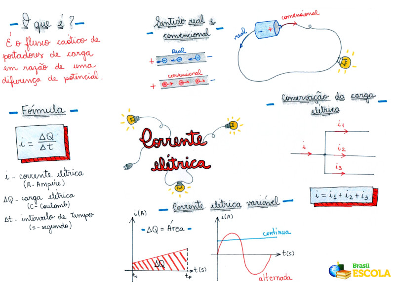

Para calcularmos a corrente elétrica, a intensidade da corrente é determinada pela razão entre a quantidade de carga que passa por uma parte especifica do condutor e o tempo que leva para passar essas cargas:

$$i = \frac{|Q|}{\Delta t}$$

com:

* $i:$ intensidade da corrente elétrica (A - ampàre);
* $Q:$ Carga elétrica (C - coulomb);
* $\Delta t:$ Intervalo de tempo (s - segundos).

Quando a direção da corrente no circuito é única, diz-se que a corrente é contínua, ou seja, o movimento dos portadores de carga que a constituem sempre ocorre da mesma forma. Quando a direção do movimento dos portadores de carga é variável, a corrente é chamada de corrente alternada.

A corrente elétrica que trafega por resistores pode transformar energia elétrica em energia térmica (calor), em um fenômeno chamado **Efeito Joule**.

A resistência de um fio condutor pode facilitar ou dificultar a passagem da corrente elétrica, sendo calculada através da fórmula da **primeira Lei de Ohm** $\left( R = \frac{U}{I} \right)$.

Nossos aparelhos elétricos e baterias, apresentam polo positivo e negativo, descrevendo a diferença de potencial presente no circuito de cada um.

É importante ressaltar que o sentido da corrente elétrica é caracterizada de duas maneiras. Real e convencional:

* **Corrente elétrica real** é aquela que possui o sentido do movimento dos elétrons, ou seja, os elétrons vão em direção as cargas positivas.
* **Corrente elétrica convencional** é aquela, cujo o sentido é o contrário da real, ou seja, as cagas positivas vão em direção aos elétrons.

No SI, a intensidade da corrente elétrica é medida em ampère (A), a resistencia em Ohm ($\Omega$) e a tensão elétrica (ddp) é medida em Volts (V).

Os condutores elétricos são materiais que permitem a movimentação de elétrons, ou seja, a passagem de corrente. Um material pode ser um condutor dependendo da sua diferença de potencial ao qual ele está submetido.

Os melhores condutores elétricos são os metais, enquanto, materiais que dificultam a passagem dos elétrons são chamados de isolantes, como madeira, plástico e papel.

Existem três diferentes tipos de condutores:

* **sólido** - Caracterizado pelo movimento dos elétrons livres;
* **Liquidos** - Movimento de cargas positivas e negativas;
* **Gasosos** - Movimento de cátions e ânions.

A tensão elétrica ou diferença de potencial (ddp), determina a diferencial do potencial elétrico de dois pontos num condutor. É, então, a força decorrente da movimentação dos elétrons em determinado circuito. A tensão elétrica dada pela expressão:

$$U = R*I$$

Onde,

* $U:$ Tensão elétrica (V)
* $R:$ Resistência ($\Omega$)
* $I:$ Intensidade da corrente (A)

## Densidade de corrente

A carga elétrica é uma escalar definida como a taxa da quantidade de carga por unidade de tempo que atravessa a seção de um meio condutor, dada pela equação:

$$I = \frac{dQ}{dt} = n |q|v_aA$$

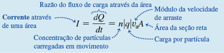

A densidade de corrente J é definida como a corrente que flui por unidade de
área da seção reta:

$$J = \frac{I}{A} = n |q|v_a$$

As unidade de densidade de corrente são ampères por metro quadrado $(A/m^2)$.

Quando as cargas que se movem forem negativas em vez de positivas a velocidade de arraste terá sentido contrário ao de $\vec{E}$ em cada ponto do condutor. Então, a densidade de corrente $J$ e a corrente $I$ não dependem do sinal da carga.

A corrente em um condutor é igual ao produto da concentração das cargas em movimento, vezes o módulo da carga de cada partícula, vezes o módulo da velocidade de arraste, vezes a área da seção reta do condutor.

Podemos definir o vetor densidade de corrente $\vec{J}$ que inclui o sentido da velocidade de arraste por:

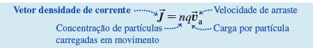

Não existe nenhum sinal de valor absoluto nesta equação. Quando $q$ é positivo, $\vec{v_a}$ tem o mesmo sentido de $\vec{E}$, e, quando $q$ é negativo $\vec{v_a}$ tem sentido oposto ao de $\vec{E}$, mas, em qualquer dos casos, $\vec{J}$ apresenta sempre o mesmo sentido de $\vec{E}$. Esta equação fornece o módulo $J$ do vetor densidade de corrente $\vec{J}$.

É importante ressaltar que a densidade de corrente $\vec{J}$ é um vetor, mas a corrente $I$ não. A diferença é que a densidade de corrente descreve como as cargas fluem em certos pontos, e o sentido do vetor descreve o sentido do fluxo nesse ponto. Em contra partida, a corrente $I$ descreve como as cargas fluem através de um objeto estendido, como um fio.

## Lei de Ohm

A densidade de corrente $\vec{J}$ em um condutor depende do campo elétrico $\vec{E}$ e das propriedades do material. Essa dependência, em geral, é muito complexa. Mas, para certos materiais, especialmente para os metais, em uma dada temperatura, $\vec{J}$ é quase diretamente proporcional a $\vec{E}$, e a razão entre os módulos $E$ e $J$ permanece constante. Essa relação é a lei de Ohm.

## Resistividade

A resistividade $\rho$ de um material como a razão entre o módulo do campo elétrico e o módulo da densidade de corrente é dado por:

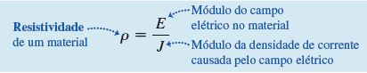

Quanto maior for o valor da resistividade, maior será o campo elétrico necessário para produzir uma dada densidade de corrente, ou menor será a densidade de corrente gerada por um dado campo elétrico. Podemos observar na equação a cima que as unidades de $\rho$ são:
 $$\frac{\frac{V}{m}}{\frac{A}{m^2}} = V* \frac{m}{A}$$

 $1 V/A$ denomina-se 1 ohm. Logo, as unidades SI de $\rho$ são $\Omega * m$ (ohm vezes metro).

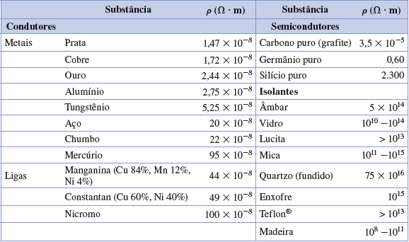

Alguns valores da resistividade são indicados na acima. Um condutor perfeito deveria ter resistência igual a zero e um isolante perfeito deveria ter resistência infinita. Os metais e as ligas metálicas são os materiais com menor resistividade e também os melhores condutores. A resistividade de um isolante é cerca de $10^{22}$ vezes mais elevada que a resistividade de um condutor.

O inverso da resistividade é a condutividade. Suas unidades SI são $(\Omega * m)^{-1}$. Um bom condutor de eletricidade possui condutividade muito maior que um isolante. A condutividade elétrica é análoga à condutividade térmica. Um bom condutor elétrico, como um metal, geralmente é um bom condutor de calor. Um mau condutor elétrico, como plástico ou cerâmica, costuma ser um mau condutor de calor. Em um metal, os elétrons livres, que são os portadores de carga na condução elétrica, também são os principais responsáveis pela condução de calor, portanto espera-se que haja uma relação entre a condutividade elétrica e a condutividade térmica. Como existe uma enorme diferença entre a condutividade de um condutor e a de um isolante, é fácil delimitar a corrente elétrica em determinados caminhos ou circuitos. Porém, como a diferença entre a condutividade térmica de um condutor de calor e a condutividade de um isolante é apenas um fator aproximadamente igual a $10^3$, em geral é impossível confinar um fluxo de calor com a mesma facilidade da corrente elétrica.

---------------------------
__Ex:__

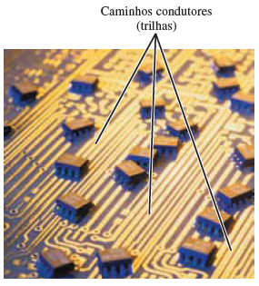

Os “fios” de cobre, ou trilhas, nesta placa de circuito, são diretamente impressos na superfície da placa isolante de cor escura. Embora os traços estejam muito próximos uns dos outros (somente cerca de um milímetro de distância), a placa possui uma resistividade tão alta (e uma baixa condutividade) em comparação à do cobre que não há nenhum fluxo de corrente entre os traços.

---------------------------

Um semicondutor possui resistividade intermediária entre a condutividade de um metal e a condutividade de um isolante. Esse tipo de material é importante por causa do modo como sua resistividade varia com a temperatura e com as impurezas.

Um material que obedece razoavelmente à lei de Ohm denomina-se condutor ôhmico ou condutor linear. Para esse tipo de material, a uma dada temperatura, $\rho$ é uma constante que não depende do valor de $E$. Muitos materiais exibem um comportamento substancialmente diferente do indicado pela lei de Ohm, chamados de materiais não ôhmicos ou não lineares. Para esses materiais, $J$ depende de $E$ de modo mais complexo.

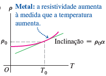

A resistividade de um condutor metálico quase sempre cresce com o aumento da temperatura, como mostra a imagem a cima. À medida que a temperatura aumenta, os íons do condutor vibram com uma amplitude mais elevada, aumentando a probabilidade de colisões dos elétrons com os íons. Isso dificulta o arraste dos elétrons através do condutor e, portanto, faz diminuir a corrente. Havendo um intervalo de temperatura pequeno (até cerca de $100 °C$), a resistividade de um metal pode ser aproximadamente representada pela equação:

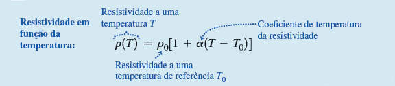

A temperatura de referência T0 geralmente é considerada como igual a $0 °C$ ou $20 °C$. A temperatura $T$ pode ser maior ou menor que $T0$. O fator $\alpha$ denomina-se coeficiente de temperatura da resistividade. Alguns valores típicos desse
coeficiente são indicados na tabela abaixo. A resistividade da liga de manganina é praticamente independente da temperatura.

| Material          | $\alpha [(°C)^{-1}]$ | Material   | $\alpha [(°C)^{-1}]$ |
| :---------------- | :------------------- | :--------- | :------------------- |
| Alumínio          | $0.0039$             | Chumbo     | $0.0043$             |
| Latão             | $0.0020$             | Manganina  | $0.0000000$          |
| Carbono (grafite) | $- 0.0005$           | Mercúrio   | $0.00088$            |
| Constantan        | $0.00001$            | Nicromo    | $0.0004$             |
| Cobre             | $0.00393$            | Prata      | $0.0038$             |
| Ferro             | $0.0050$             | Tungstênio | $0.0045$             |
---------

A resistividade do grafite (um material não metálico) diminui quando a temperatura aumenta, visto que, em temperaturas elevadas, muito mais elétrons “se desprendem” dos átomos e adquirem maior mobilidade, com isso, o coeficiente de temperatura da resistividade do grafite é negativo. O mesmo tipo de comportamento ocorre para os materiais semicondutores.

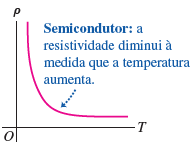

A medida da resistência de um pequeno cristal semicondutor pode servir, então, para uma sensível medida de temperatura. Esse é o princípio de funcionamento de um termômetro denominado termistor.

Alguns materiais, incluindo metais, ligas metálicas e óxidos, apresentam um fenômeno chamado supercondutividade. À medida que a temperatura diminui, a resistividade cai, no início, lentamente, como em qualquer metal. Porém, para uma certa temperatura crítica $T_c$, ocorre uma transição de fase, e a resistividade diminui bruscamente.

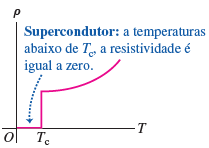

Se uma corrente for estabelecida em um anel supercondutor, ela permanecerá circulando no anel indefinidamente, sem a necessidade de nenhuma fonte de alimentação.

## Resistência

Para um condutor com resistividade r, a densidade de corrente $\vec{J}$ em um ponto que possui um campo elétrico $\vec{E}$ é dada pela equação:

$$\vec{E} = \rho \vec{J}$$

Quando a lei de Ohm é válida, $\rho$ permanece constante e não depende do módulo do campo elétrico, então, $\vec{E}$ é diretamente proporcional a $\vec{J}$. Mas, geralmente estamos mais interessados em saber o valor da corrente total $I$ em um condutor que o valor de $\vec{J}$ e mais interessados em saber o valor da diferença de potencial $V$ nas extremidades do condutor que o valor de $\vec{E}$. A razão disso é que as medidas de corrente e de diferença de potencial são mais fáceis de serem estabelecidas que as medidas de $\vec{J}$ e de $\vec{E}$.

Vamos supor um fio como um condutor de comprimento $L$ e seção reta uniforme com área A como na imagem abaixo.

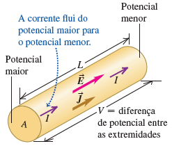

Seja $V$ a diferença de potencial entre a extremidade com potencial maior e a extremidade com potencial menor, de modo que $V$ seja positivo.  A corrente flui sempre no sentido da extremidade com potencial maior para a de potencial menor. Isso ocorre porque a corrente em um condutor flui no sentido do vetor $\vec{E}$ para qualquer que seja o sinal das cargas que se movem e porque o vetor $\vec{E}$ aponta no sentido da diminuição do potencial elétrico. Enquanto a corrente flui através da diferença de potencial, ocorre perda de energia potencial elétrica, essa energia é transferida aos íons do material do condutor durante as colisões.

Podemos também relacionar o valor da corrente $I$ à diferença de potencial nas extremidades do condutor. 

Seja módulos da densidade de corrente de corrente $\vec{J} e campos elétricos $\vec{E}$ uniformes através de um condutor. A corrente total $I$ é dada por $I = JA$ e a diferença de potencial $V$ a extremidade é data por $V = EL$. Resolvendo essas equações para $E$ e $J$ e substituindo os valores, temos:

$$\frac{V}{L} = \frac{\rho I}{A} \newline ou \newline V = \frac{\rho L}{A}I$$

O resultando dessa equação irá mostrar que, quando $\rho$ é constante, a corrente total $I$ é proporcional à diferença de potencial $V$.

A razão entre $V$ e $I$ para um dado condutor denomina-se resistência $R$:

$$R = \frac{A}{I}$$

Comparando a definição de R com á equação anterior temos:

Quando $\rho$ é constante, como no caso dos materiais ôhmicos, então $R$ também é.

A seguinte equação geralmente é chamada de lei de Ohm:

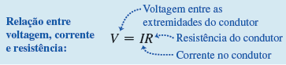

Entretanto, é importante entender que o verdadeiro significado da lei de Ohm consiste na indicação de uma proporcionalidade direta (para alguns materiais) de $V$ com $$ ou de $J$ com $E$.

As Equações da resistência $R$ e da lei de Ohm apresentadas anteriormente define a resistência $R$ para qualquer condutor que obedeça ou não à lei de Ohm, porém somente no caso de $R$ ser constante é que essa relação pode ser chamada corretamente de lei de Ohm.

Podemos mostrar pela equação $R = \frac{\rho L}{A}$ que a resistência de um fio ou de outro condutor com seção reta uniforme é diretamente proporcional ao comprimento do fio e inversamente proporcional à área de sua seção reta. Ela também é proporcional à resistividade do material de que o condutor é feito.

Utilizando a analogia de escoamento de um fluido, uma mangueira fina transportando água oferece uma resistência maior que outra grossa, e uma mangueira longa possui resistência maior que outra curta. Podemos fazer a resistência aumentar preenchendo o tubo com algodão ou areia, correspondo a um aumento de resistividade. A vazão é diretamente proporcional à diferença de pressão entre as extremidades da mangueira. A vazão do fluido é análoga à corrente elétrica, e a diferença de pressão é análoga à diferença de potencial (voltagem). Porém, não seria bom levarmos essa analogia longe demais, pois, a vazão em um tubo geralmente não é proporcional à área de sua seção reta.

A unidade SI de resistência é o ohm, que é igual a um volt por ampère $(1 \Omega = 1 V/A)$. O quilo-ohm $(1 K \Omega = 10^3 \Omega)$ e o megaohm $(1 M \Omega = 10^6 \Omega)$ também são unidades comumente usadas. Um fio de cobre de calibre 12 com 100 m de comprimento, um tamanho usual na fiação de uma casa, possui uma resistência igual a $0.5 \Omega$ em temperatura ambiente. Uma lâmpada de $100 W$ para $120 V$ possui uma resistência igual a $140 \Omega$ (na temperatura em que ela se encontra quando está acesa). Quando a mesma corrente $I$ flui na lâmpada e no fio de cobre, a diferença de potencial $v = IR$ é muito maior através da lâmpada e bem mais energia potencial é perdida nela. Essa energia perdida é convertida pelo filamento da lâmpada em luz e calor. Como ninguém deseja que a fiação de sua casa fique incandescente, a resistência da fiação deve ser mantida pequena, usando-se um fio com resistividade pequena e área grande em sua seção reta.

Como a resistividade de um material varia com a temperatura, a resistência de um condutor específico também varia dessa forma. Para intervalos de temperatura não muito elevados, essa variação é dada aproximadamente por uma relação linear, análoga à:

$$R(T) = R_0 [1 + \alpha (T-T_0)]$$

Nesta equação, $R(T)$ é a resistência a uma temperatura $T$, e $R_0$ é a resistência a uma temperatura $T_0$, geralmente tomada como $0 ºC$ ou $20ºC$.

#### Código de cores para resistores.

| Cor      | valor do dígito | Valor do multiplicador |
| :------- | :-------------: | :--------------------: |
| Preta    |        0        |           1            |
| Marrom   |        1        |           10           |
| Vermelho |        2        |         $10^2$         |
| Laranja  |        3        |         $10^3$         |
| Amarelo  |        4        |         $10^4$         |
| Verde    |        5        |         $10^5$         |
| Azul     |        6        |         $10^6$         |
| violeta  |        7        |         $10^7$         |
| Cinza    |        8        |         $10^8$         |
| Branca   |        9        |         $10^9$         |
---------------

Um resistor é um elemento que possui um dado valor de resistência em suas extremidades. Os resistores individuais usados em circuitos eletrônicos geralmente são cilindros com dimensões de alguns milímetros de diâmetro e de comprimento, e possuem fios que saem de suas extremidades. A resistência pode ser marcada sobre o resistor usando-se um código padrão de três ou quatro faixas coloridas próximo de uma das extremidades, seguindo a convenção indicada na tabela acima. As duas primeiras faixas (começando com a faixa mais próxima de uma das extremidades) indicam dígitos, e a terceira faixa mostra o fator de multiplicação em potência de 10. Por exemplo, a combinação de cores verdevioletavermelho teria uma resistência igual a $57 X 10^2 \Omega$ ou $5.7 K \Omega$. A quarta faixa, quando existe, indica a precisão do valor; quando não há nenhuma faixa, a precisão é de $\pm 20\%$, para para uma faixa prateada, a precisão é de $\pm 10\%$ e, para uma uma faixa dourada, a precisão é de $\pm 5\%$. Outra característica importante de um resistor é a potência máxima que ele pode dissipar sem se danificar.

Para um resistor que obedece à lei de Ohm, um gráfico da corrente em função da diferença de potencial (voltagem) é uma linha reta.

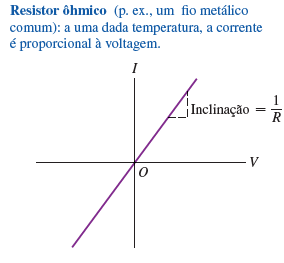

A inclinação da reta é igual a $\frac{1}{R}$ Quando o sinal da diferença de potencial varia, o sinal da corrente também varia.

Nos dispositivos que não obedecem à lei de Ohm, a corrente pode não ser proporcional à voltagem e ela pode não ser invertida com a inversão da voltagem.

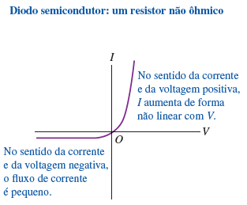

Na figura acima que indica o comportamento de um diodo semicondutor, que é um dispositivo usado para converter uma corrente alternada em corrente contínua e para executar uma ampla gama de funções lógicas em um circuito de computador. Quando o potencial $V$ do anodo (um dos dois terminais do diodo) é positivo em relação ao do catodo (o outro terminal), $I$ aumenta exponencialmente em relação ao aumento de $V$, para potenciais negativos, a corrente é extremamente pequena. Então, uma diferença de potencial positiva $V$ produz uma corrente que flui no sentido positivo, entretanto, uma diferença de potencial negativa não produz praticamente nenhuma corrente. Portanto, um diodo funciona como se fosse uma válvula que só deixa a corrente passar em um dado sentido pelo circuito.

